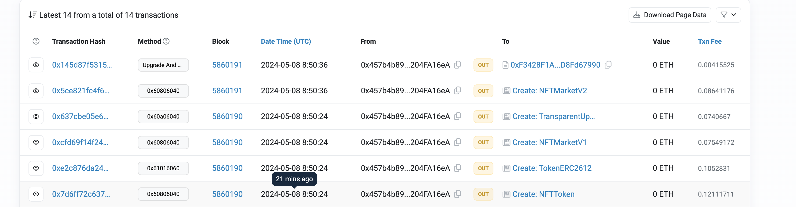

## deploy-sepolia

nftPermit
https://sepolia.etherscan.io/address/0x3226DFd387AEc5f0338A4EF1531ED85534BF5e92

NFTToken
https://sepolia.etherscan.io/address/0x3E02F618F4c03c9aA4Abcef95897Be9916241b0C

NFTMarketV1
https://sepolia.etherscan.io/address/0x81F31AE604fe5364b224A68418dabEE409608cC3

ProxyAdmin
https://sepolia.etherscan.io/address/0xF3428F1A92433afE983fE9b37fC77f2D8Fd67990

NFTMarketV2
https://sepolia.etherscan.io/address/0x890b8e0B769407c2d7B2D16B1Ab82e1EAE8ECE9f


TransparentUpgradeableProxy（代理合约）
https://sepolia.etherscan.io/address/0x8157f6658c77be6fdcf7f1fc1e4fcd86b0721efb



[日志文件](deploy-sepolia-log.txt)

```shell
$ forge --help
$ anvil --help
$ cast --help
```
